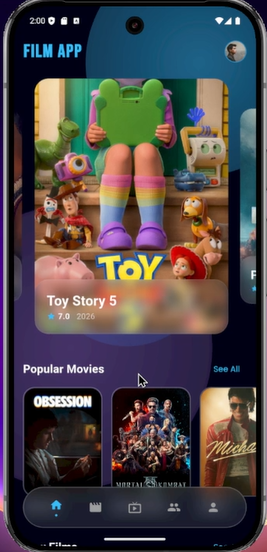
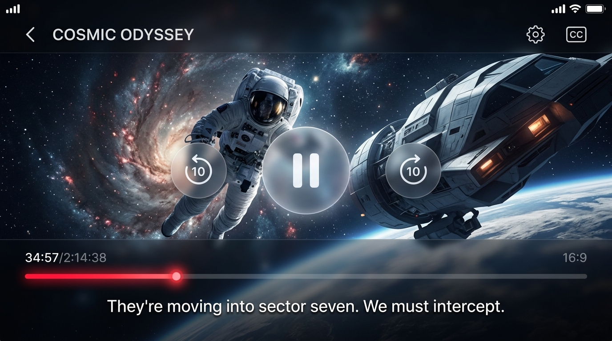

# 🎬 FilmApp - Premium Movie & TV Series Streaming Client

FilmApp is a commercial-grade, high-performance, and visually stunning movie/TV series streaming application built with Flutter. Designed with a modern, glassmorphic dark-theme aesthetic, it offers a seamless cinema-like experience directly on mobile devices. 

This repository is optimized for production, utilizing **Clean Architecture** patterns and **BLoC (Business Logic Component)** state management for maximum scalability, testing, and ease of API integration.

---

## 📸 Mockups & UI Showcase

| Home Screen Feed | Premium Custom Video Player |
| :---: | :---: |
|  |  |

---

## ✨ Features

### 🌟 Premium Interface & UI
* **Modern Dark Theme**: Curated neon red and purple accents, tailored dark HSL colors, and smooth custom transitions.
* **Glassmorphic Navigation & Containers**: High-end visual depth using custom glass layouts.
* **Cinematic Banners**: Auto-sliding premium movie carousels with smooth animations.

### 🎥 Advanced Video Player (Custom Built)
* **Smart Gesture Controls**: 
  - Double-tap on the left or right third of the screen to skip 10 seconds backward or forward.
  - Tap anywhere (including background letterboxes) to instantly show/hide the controls overlay.
* **Opaque Overlay & Auto-Hide**: Controls automatically fade out after 3 seconds of inactive playing. Auto-hide pauses if the video is paused or a settings panel is open.
* **Timed Multi-lingual Subtitles**: Real-time subtitles matching video playback for English, Spanish, and French.
* **Interactive Playback Settings**: Choose playback speeds (`0.5x`, `1.0x`, `1.5x`, `2.0x`) and video qualities (`Auto`, `1080p`, `720p`, `480p`).

### 📂 Feature Modules
* **Movie & TV Details**: Dynamic actor lists, synopsis, ratings, and embedded trailers (using YouTube API integration).
* **Watchlist**: Local watchlist state powered by robust state management.
* **Downloads Manager**: Simulated download workflow with accurate progress indicators.
* **Global Search & Filter**: Search movies and filter by categories, genres, or release years.
* **Account Settings**: Dedicated account screens for profile settings, streaming history, and device orientations.

---

## 🏗️ Architecture & Codebase Design

The project is structured following **Clean Architecture** principles to separate business logic, data contracts, and UI components:

```
lib/
├── core/                   # Shared theme, constants, network clients, and global widgets
└── features/
    ├── auth/               # User Authentication module
    ├── content/            # General landing and home content layout
    ├── movies/             # Movies module (Data, Domain, Presentation layers)
    │   ├── data/           # Models, repositories implementation, and datasources (Mock / TMDB)
    │   ├── domain/         # Entities, usecases, and repository contracts
    │   └── presentation/   # BLoC state management, pages, and custom widgets
    └── tv_series/          # TV Series module (Clean Architecture structure)
```

### ⚡ Key Packages Used
* **State Management**: `flutter_bloc` & `equatable`
* **Dependency Injection**: `get_it`
* **Networking**: `dio`
* **Local Storage**: `hive` & `hive_flutter`
* **Media Rendering**: `video_player`, `youtube_player_flutter`, and `cached_network_image`
* **Device Utility**: `wakelock_plus`, `screen_brightness`

---

## 🚀 Getting Started

### Prerequisites
Make sure you have [Flutter SDK](https://docs.flutter.dev/get-started/install) installed on your system.

* SDK compatibility: `>=3.0.0 <4.0.0`

### Installation & Run

1. **Clone the repository:**
   ```bash
   git clone https://github.com/your-username/film_app.git
   cd film_app
   ```

2. **Install dependencies:**
   ```bash
   flutter pub get
   ```

3. **Generate local database adapters (if modifying Hive models):**
   ```bash
   flutter pub run build_runner build --delete-conflicting-outputs
   ```

4. **Run the app in debug mode:**
   ```bash
   flutter run
   ```

### Building for Production

* **Android (APK):**
  ```bash
  flutter build apk --release
  ```
* **Android (App Bundle for Play Store):**
  ```bash
  flutter build appbundle --release
  ```
* **iOS (Xcode Archive):**
  ```bash
  flutter build ipa --release
  ```

---

## 💰 Commercialization & Monetization Potential

This template is ready-made to be sold as a premium template on platforms like **CodeCanyon**, **Gumroad**, or directly to private clients. Here's why it has high value:
1. **API-Ready Structure**: The repositories in the `data` layer can be connected to any backend or directly to the [TMDB API](https://developer.themoviedb.org/docs) with minimal configuration.
2. **Production-Ready Player**: The custom video player handles subtitles, orientation locks, wake locks, and playback adjustments natively.
3. **Optimized for AdMob/Subscription**: The Clean Architecture makes it simple to integrate ad layers (e.g., ad banners or interstitials) or subscription subscription checks.

---

## 📝 License

This project is licensed under the MIT License - see the [LICENSE](LICENSE) file for details.
